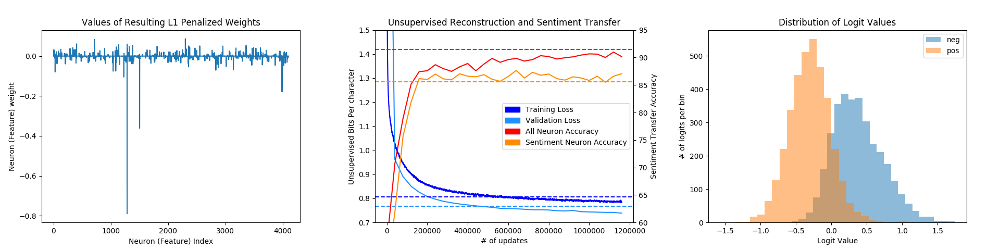
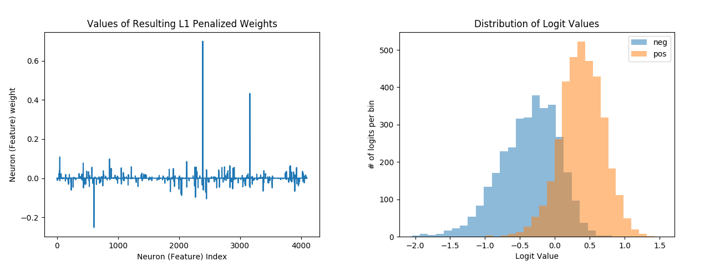

# PyTorch Unsupervised Sentiment Discovery
This PyTorch codebase is part of our effort to reproduce the [Generating Reviews and Discovering Sentiment](https://openreview.net/forum?id=SJ71VXZAZ&noteId=SJ71VXZAZ) for the [ICLR reproducability challenge](http://www.cs.mcgill.ca/~jpineau/ICLR2018-ReproducibilityChallenge.html). Check out our in-depth reproducability report (coming soon) and blog post (coming soon) for more details.

This code implements a **multi-layer [Multiplicative LSTM](https://arxiv.org/abs/1609.07959)** in **PyTorch** for training/sampling from character-level language models in an unsupervised fashion. 

Utilizing this unsupervised language model to then featurize text samples for sentiment analysis leads to the observation that a single neuron in the mLSTM cell state corresponds directly to sentiment, and is able to separate the text samples into pos/neg clusters based on the logit values of this single neuron.



For a detailed introduction into character-level language modeling with recurrent networks, we encourage looking at the original [char-rnn](https://github.com/karpathy/char-rnn) repository.

### Motivation
The success of Deep Learning is not enjoyed to the same extent in the domain of Natural Language Processing (NLP). This is in part due to the supervised nature of other DL tasks, while creating NLP datasets for supervised learning is limited in scope to a few domains such as NMT, tree parsing, and sentiment analysis to name a few. In our experience creating large labeled language datasets has proven difficult due to the fact that labeling natural language data requires labelers with high degrees of reading comprehension as opposed to being able to classify images/draw bounding boxes for Computer Vision tasks. 

Given this bottleneck we see robust unsupervised learning regimes for natural language as an exciting new research avenue in order to mitigate the dependence on labeled data needed for language tasks. 

We focus on the domain of sentiment analysis as it both
 * has a large corpus of research, datasets, and benchmarks
 * is a discriminitive classification task that can benefit from robust featurizations of text (which can be provided by an unsupervised language model)

## Scalability
Training a model on an amazon-review-sized dataset is a significant time investment. In order to improve our ability to iterate on experiments we found it imperative early on to investigate the scalability of data parallelism in PyTorch.

Our final model was trained using a batch size of 128 on 8 Volta-class gpus.

### Learning Rate Scaling
We take queues from recent work in training imagenet at scale and leverage [FAIR's (Goyal et. al 2017)](https://arxiv.org/pdf/1706.02677.pdf) linear scaling rule. To account for our 4x batch size increase and 2x gpu increase we used a learning rate of `5e-4 * 8 -> 4e-3`.

At this time we have not taken advantage of the other proposed techniques that worked well in our literature review

### (Distributed)DataParallel scaling
Our investigation unfortunately held up fears from the PyTorch community about the abysmall performance of data parallelism with recurrent networks. Pytorch's vanilla DataParallelism wrapper produces next to no speedup for recurrent architectures due to issues related to the python Global Interpretter Lock. 

All the parallel python threads involved in PyTorch's DataParallelism use the same c-backed data structure to aggregate gradients in and run tensor ops with. In order to ensure thread-safe execution the python threads compete for a global lock needed to interpret python commands that run the computation grpah on the GPU. This is problematic for recurrent architectures, where there are numerous of the same operation to call, each requiring only a little computation (as opposed to the heftier operations characteristic of image-processing models). In recurrent architectures no speedup will be observed as each thread spends a significant portion of time either passing this lock around or waiting for it.

Distributed Data Parallel was fortunately not plagued by the same lock problems. Distributed Data Parallel starts a separate process for each model replica and communicates gradient updates directly via all-reduce calls on the gpu for minimal latency. This allows for relatively linear scaling accounting for redundant data processing being done in each process, which we'll adress in future updates.

 Data Parallelism Scalability")

As you can see next to no speedup is observed when utilizing normal pytorch data parallelism.

Additionally, we tried setting `torch.backends.cuda.benchmark=True`, but it provided no observable benefit to scalability either, and in fact slightly hurt performance due to its additional overhead. We have yet to analyze this in depth.

## Open Questions
The best research work often leaves the reader with more questions than it answers. Here's some of the questions we thought of while reproducing this work and are now working on as a result.
 * Waiting for long training runs to end can be frustrating. How can we improve the speed and scalability of our system without sacrificing convergence/performance?
 * Sentiment is more black and white than good/bad, it's much more nuanced and a result of multiple factors. What are the other neurons in our sentiment classification weights detecting? What other discriminitive language tasks would these features do well on?
   * More generally, what other tasks could unsupervised language modeling at scale be used for? 
 * Our model learned sentiment because it was a relevant piece of information for reconstruction of product reviews, not because it was told to learn sentiment. In our case we even found that it actually learned negative sentiment. In an ideal scenario we would have the ability to supervise/force our model to learn/learn about a specific characteristic, such as author frustration.  
  * Given a task we want to transfer to, how can we use performance on that task to regularize what our model learns about language?  
 * The performance of the model on sentiment transfer seems to have a slight dependence on the most recently trained examples from our dataset. Due to this dependence on data, we'd ideally like to fine tune our model to a subset of data that is relevant to the task being transferred to. 
  * With this in mind, given a specific subset of data, how can we fine-tune our language model to the specified data without losing the general language properties of the larger corpus?

## Setup
### Install
Install the sentiment_discovery package with `pip setup.py install` in order to run the modules/scripts within this repo.

### Python Requirements
 * numpy
 * pytorch
 * pandas
 * scikit-learn
 * matplotlib
 * unidecode

### Pretrained models
Download our pretrained mlstm model via https://drive.google.com/open?id=1JxoMiVqPSb8liLlNRvyZYRObi0kOHwXM

### Data Downloads
TODO

## Usage
In addition to providing easily reusable code of the core functionalities of this work in our `sentiment_discovery` package, we also provide scripts to perform the three main functionalities in the paper:
 * unsupervised reconstruction/language modeling of a corpus of text
 * transfer of learned language model to perform sentiment analysis on a specified corpus
 * heatmap visualization of sentiment in a body of text, and conversely generating text according to a fixed sentiment

Script results will be saved/logged to the `<experiment_dir>/<experiment_name>/*` directory hierarchy.

### Unsupervised Reconstruction
Train a recurrent language model (mlstm/lstm) and saves it to the `<model_dir>/` directory in the above hierarchy. The metric histories will be available in the appropriate `<history>/` directory in the same hierarchy. In order to apply `weight_norm` only to lstm parameters as specified by the paper we use the `-lstm_only` flag.


```
python text_reconstruction.py -experiment_dir ./experiments -experiment_name mlstm -model_dir model -cuda \
-embed_size 64 -rnn_size 4096 -layers 1 -weight_norm -lstm_only -rnn_type mlstm -dropout 0 -persist_state 1 \
-seq_length 256 -batch_size 32 -lr 0.000125 --optimizer_type=Adam -lr_scheduler LinearLR -epochs 1  \
-train data/amazon/reviews.json -valid data/amazon/reviews.json -test data/amazon/reviews.json -data_set_type unsupervised \
-lazy -text_key sentence
 
```


The training process takes in a json list (or csv) file as a dataset where each entry has key (or column) `text_key` containing samples of text to model.

The unsupervised dataset will proportionally take 1002 (1000 train) shards from the training, validation, and test sets.

The dataset entries are [transposed](https://yagr.nvidia.com/ADLR/sentiment-os/blob/master/sentiment_discovery/data_utils/samplers.py#L114) to allow for the concatenation of sequences in order to persist hidden state across a shard in the training process.

Hidden states are reset either at the start of every sequence, every shard, or never based on the value of `persist_state`. See [data flags](#data-flags).

Lastly, We know waiting for more than 1 million updates over 1 epoch for large datasets is a long time. We've set the training script to save the most current model (and data history) every [5000 iterations](https://yagr.nvidia.com/ADLR/sentiment-os/blob/master/text_reconstruction.py#L81), and also included a `-max_iters` flag to end training early.

<!---We train an mLSTM with the specified parameters and save it to the directory `<model_dir>/<save_model>`. -->
<!--move up-->
<!--We train the model with Adam and a linearly decaying learning rate as per the paper. Note that we utilize an `lr` of `1.25e-4` as opposed to the paper's `5e-4` in order to account for the decreased batch size (the original paper had `batch_size` 32 x 4 gpus) and keep sample temperature the same. Lastly we apply weight normalization to the mLSTM parameters via the `-weight_norm` flag.-->

<!--The training process will take in a json list file as a dataset where each entry has key `text_key` denoting samples of text to model. As specified in the paper there are a total of 1002 shards (1000 training, 1 validation, 1 test), so we divide `train` into 1002 shards and take the first 1000, and divide `valid`/`train` into 1002 shards and take shard 1001/1002 respectively. The dataset entries will be transposed according to `batch_size` so that they might be concatenated in order to persist hidden state across a shard in the training process. https://yagr.nvidia.com/ADLR/sentiment-os/blob/master/sentiment_discovery/data_utils/samplers.py#L114-->


The resulting loss curve over 1 (x4 because of data parallelism) million iterations should produce a graph similar to this.

**Note:** if it's your first time modeling a particular corpus make sure to turn on the `-preprocess` flag.

#### Reconstruction Flags
For a list of default values for all flags look at `./cfg/configure_text_reconstruction.py`
 * `no_loss` - do not track the loss curve of the model
 * `lr` - Starting learning rate.
 * `lr_scheduler` - one of [ExponentialLR,LinearLR]
 * `lr_factor` - factor by which to decay exponential learning rate
 * `optimizer_type` - Class name of optimizer to use as listed in torch.optim class (ie. SGD, RMSProp, Adam)
 * `clip` - Clip gradients to this maximum value. Default: 1.
 * `epochs` - number of epochs to train for
 * `max_iters` - total number of training iterations to run. Takes presedence over number of epochs
 * `start_epoch` - epoch to start training at (used to resume training for exponential decay scheduler)
 * `start_iter` - what iteration to start training at (used mainly for resuming linear learning rate scheduler)

### Sentiment Transfer
This script parses sample text and binary sentiment labels from csv (or json) data files according to `-text_key`/`label_key`. The text is then featurized with the previously trained models by running the model over the text and extracting the cell (not hidden) state from the last timestep. The resulting featurizations are then used to fit an sklearn logistic regression model with an L1 penalty (using the validation data to select a regularization parameter).

The index of the resulting model weight with the greatest magnitude is then used as the index of the sentiment neuron. The relavent sentiment feature is extracted and then also fit to a logistic regression model in a similar manner.

Below is example output for running our trained model on the Binary Stanford Sentiment Treebank task.

```
python3 sentiment_transfer.py -experiment_dir ./experiments -experiment_name mlstm -model_dir model -load_model e0.pt -cuda \
-train binary_sst/train_binary_sent.csv -valid binary_sst/dev_binary_sent.csv -test binary_sst/test_binary_sent.csv -text_key sentence -label_key label
```

```
92.11/90.02/91.27 train/val/test accuracy w/ all_neurons
00.12 regularization coef w/ all_neurons
00107 features used w/ all neurons all_neurons
neuron(s) 1285, 1503, 3986, 1228, 2301 are top sentiment neurons
86.36/85.44/86.71 train/val/test accuracy w/ n_neurons
00.50 regularization coef w/ n_neurons
00001 features used w/ all neurons n_neurons
```


<!-- The resulting featurizations and original labels are then used to run sklearn's logistic regression on the data with an L1 penalty (we also perform cross-validation against the featurizations of the validation set to select a regularization parameter) to induce sparseness and isolate a "sentiment neuron" based on the neuron with the largest L1 penalty. After processing the data set with all the neurons the sentiment neurons are then used to predict the sentiment value as well. -->

With the paper's model:

```
python3 sentiment_transfer.py -experiment_dir ./experiments -experiment_name mlstm_paper -model_dir model -load_model e0.pt -cuda \
-train binary_sst/train_binary_sent.csv -valid binary_sst/dev_binary_sent.csv -test binary_sst/test_binary_sent.csv -text_key sentence -label_key label
```

```
92.08/91.74/91.49 train/val/test accuracy w/ all_neurons
00.12 regularization coef w/ all_neurons
00107 features used w/ all neurons all_neurons
neuron(s) 2388, 3159, 607, 2449, 2269 are top sentiment neurons
86.17/86.01/85.61 train/val/test accuracy w/ n_neurons
00.50 regularization coef w/ n_neurons
00001 features used w/ all neurons n_neurons
```



These results are saved to `./experiments/mlstm/binary_sst/e0/*`

**Note** The other neurons are firing, and we can use these neurons in our prediction metrics by setting `-num_neurons` to the desired number of heavily penalized neurons. Even if this option is not enabled the logit visualizations/data are always saved for at least the top 5 neurons.

#### Transfer Flags
For a list of default values for all involved flags look at `./cfg/configure_sentiment_transfer.py`
 * `num_neurons` - number of neurons to consider for sentiment classification
 * `no_test_eval` - do not evaluate the test data for accuracy (useful when your test set has no labels)
 * `write_results` - write results (output probabilities as well as logits of top neurons) of model on test (or train if none is specified) data to specified filepath. (Can only write results to a csv file)

### HeatMap Visualization
This script takes a piece of text specified by `text` and then visualizes it via a karpathy-style heatmap based on the activations of the specified `neuron`. In order to find the neuron to specify, find the index of the neuron with the largest l1 penalty based on the neuron weight visualizations from the previous section. 

Without loss of generality we're going to go through this section first referring to the paper's neuron weights. For this set of weights the sentiment neuron can be found at neuron 2388.


Armed with this information we can use the script to analyze the following exerpt from the beginning of a review about The League of Extraordinary Gentlemen.

```
python3 visualize.py -cuda -experiment_dir ./experiments -experiment_name mlstm_paper -model_dir model -neuron 2388 -load_model e0.pt \
-text "25 August 2003 League of Extraordinary Gentlemen: Sean Connery is one of the all time greats and I have been a fan of his since the 1950's." 
```


However, not only does this script analyze text, but the user can also specify the begining of a text snippet with `text` and generate additional following text up to a total `seq_length`. Simply set the `-generate` flag.

```
python3 visualize.py -cuda -experiment_dir ./experiments -experiment_name mlstm_paper -model_dir model -load_model e0.pt -neuron 2388 \
-text "25 August 2003 League of Extraordinary Gentlemen: Sean Connery is" -generate
```


In addition to generating text, the user can also set the sentiment of the generated text to positive/negative by setting `-overwrite` to +/- 1. Continuing our previous example:


<!---->

<!--Lastly, the unsupervised learning process is just that, unsupervised, we never told it to learn positive sentiment neuron. As this is the case we find that occassionally we learn a negative sentiment neuron instead (as seen below). If this is the case turn on the `-negate` flag when trying to generate any heatmap (generated or not).-->

Throughout the course of this section we've detailed how to visualize sentiment heatmaps with the original model from the paper. However, a slightly different approach is needed if a negative sentiment model is learned, as is the case with our reproduction. Simply turn on the `-negate` flag in order to visualize heatmaps for negative sentiment models such as ours. This must be done regardless of whether text is being analyzed or generated. (**Note**: our negative sentiment neuron is 1285 not 2388).

```
python3 visualize.py -cuda -experiment_dir ./experiments -experiment_name mlstm -model_dir model -load_model e0.pt -neuron 1285 \
-text "25 August 2003 League of Extraordinary Gentlemen: Sean Connery is" -generate -overwrite +/-1 -negate
```


The resulting heatmaps are all saved to a png file corresponding of the first 100 characters of (generated or analyzed) text at `<experiment_dir>/<experiment_name>/heatmaps/<heatmap name>`. 

#### Visualization Flags
For a list of default values for all flags look at `./cfg/configure_visualization.py`
 * `text` - whole or initial text for visualization
 * `neuron` - index of sentiment neuron
 * `generate` - generates text following initial text up to a total length of `seq_length`
 * `temperature` - temperature from sampling from language model while generating text
 * `overwrite` - For generated portion of text overwrite the neuron's value while generating
 * `negate` - If `neuron` corresponds to a negative sentiment neuron rather than positive sentiment
 * `layer` - layer of recurrent net to extract neurons from

### Distributed Usage
```
python text_reconstruction.py -experiment_dir ./experiments -experiment_name mlstm_paper -model_dir model \
-embed_size 64 -rnn_size 4096 -layers 1 -weight_norm -rnn_type mlstm -dropout 0 \
-seq_length 256 -batch_size 32 -train data/amazon/reviews.json -valid data/amazon/reviews.json -test data/amazon/reviews.json -data_set_type unsupervised -lazy \
-lr 0.00025 --optimizer_type=Adam -lr_scheduler LinearLR -epochs 1 -persist_state 1 \
-num_gpus 2 -distributed -cuda
```

In order to utilize Data Parallelism during training time ensure that `-cuda` is in use and that `-num_gpus` >1. As mentioned previously, vanilla DataParallelism produces no speedup for recurrent architectures. In order to circumvent this problem turn on the `-distributed` flag to utilize PyTorch's DistributedDataParallel instead and experience  speedup gains. 

Also make sure to scale the [learning rate](#learning-rate-scaling) as appropriate. Note how we went from `1.25e-4` -> `2.5e-4` learning rates when we doubled the number of gpus.

## Package Modules/Flags
### Modules
 * `sentiment_discovery`
   * `sentiment_discovery.modules`: implementation of multiplicative LSTM, stacked LSTM.
   * `sentiment_discovery.model`: implementation of module for processing text, and model wrapper for running experiments
   * `sentiment_discovery.reparametrization`: implementation of weight reparameterization abstract class, and [weight norm](https://arxiv.org/abs/1602.07868) reparameterization. 
   * `sentiment_discovery.data_utils`: implementations of datasets, data loaders, data samplers, data preprocessing utils.
   * `sentiment_discovery.neuron_transfer`: contains utilities for extracting neurons and featurizing text with the values of a model's neurons.
   * `sentiment_discovery.learning_rates`: contains implementations of learning rate schedules (ie. linear and exponential decay)

### Flags

#### Experiment Flags
 * `experiment_dir` - Root directory for saving results, models, and figures
 * `experiment_name` - Name of experiment used for logging to `<experiment_dir>/<experiment_name>`.

#### Model Flags
 * `should_test` - whether to train or evaluate a model
 * `embed_size` - embedding size for data
 * `rnn_type` - one of <`mlstm`,`lstm`>
 * `rnn_size` - hidden state dimension of rnn
 * `layers` - # of stacked recurrent layers
 * `dropout` - dropout probability after hidden state (0 = None, 1 = all dropout)
 * `weight_norm` - boolean flag that when added will apply weight norm only to the recurrent (m)LSTM parameters
 * `lstm_only` - if `-weight_norm` is applied to the model, apply it to the lstm parmeters only
 * `model_dir` - subdirectory where models are saved in `<experiment_dir>/<experiment_name>`
 * `load_model` - a specific checkpoint file to load from `<experiment_dir>/<experiment_name>/<model_dir>`


#### Data Flags
 * `batch_size` - minibatch size
 * `data_size` - dimension of each data point
 * `seq_length` - length of time sequence for reconstruction/generation (sentiment inference has no maximum sequence length)
 * `data_set_type` - json or csv for sentiment transfer or unsupervised (only json available) for unsupervised reconstruction
 * `persist_state` - degree to which to persist state across samples for unsupervised learnign. 0 = reset state after every sample, 1 = reset state after finishing a shard, -1 = never reset state
 * `transpose` - transpose dataset, given batch size. Is always on for unsupervised learning, (should probably only be used for unsupervised).
 * `no_wrap` - In order to better concatenate strings together for unsupervised learning the batch data sampler does not drop the last batch, it instead "wraps" the dataset around to fill in the last batch of an epoch. On subsequent calls to the batch sampler the data set will have been shifted to account for this "wrapping" and allow for proper hidden state persistence. This is turned on by default in non-unsupervised scripts.
 * `cache` - cache recently used samples, and preemptively cache future data samples. Helps avoid thrashing in large datasets. **Note:** currently buggy and provides no performance benefit

#### Data Processing Flags
 * `lazy` - lazily load dataset (necessary for large datasets such as amazon)
 * `preprocess` - load dataset into memory and preprocess it according to section 4 of the paper. (should only be called once on a dataset)
 * `shuffle` - shuffle unsupervised dataset.
 * `text_key` - column name/dictionary key for extacting text samples from csv/json files.
 * `label_key` - column name/dictionary key for extacting sample labels from csv/json files. 
 * `delim` - column delimiter for csv tokens (eg. ',', '\t', '|')
 * `drop_unlabeled` - drops unlabeled samples from csv/json file 
 * `binarize_sent` - if sentiment labels are not 0 or 1, then binarize them so that the lower half of sentiment ratings get set to 0, and the upper half of the rating scale gets set to 1.

#### Dataset Path Flags
 * `train` - path to training set
 * `split` - float value in [0,1] range. If no validation set is specified then proportionally split training set into `split` and `1-split` training/validation sets
 * `valid` - path to validation set
 * `test` - path to test set

#### Learning Flags
 * `should_test` - whether to train or evaluate a model. Used in `text_reconstruction.py`
 * `no_loss` - If `should_test` is on then no loss is calculated in addition to no optimization being performed
 * `lr` - intial learning rate
 * `lr_scheduler` - learning rate scheduling regime <ExponentialLR,LinearLR>
 * `lr_factor` - decay factor if exponential learning rate decay is used.
 * `optimizer_type` - Optimizer type to use. This should be a class name from torch.optim (ex. SGD, Adam, etc.)
 * `clip` - Gradient clipping value. Bound all gradient values from [-clip, clip]
 * `epochs` - Number of epochs to run training for
 * `max_iters` - Can specify max number of training updates instead of number of epochs to run. `max_iters` takes presedence over `epochs`.
 * `start_epoch` - Epoch to resume training from if `epochs` is being used.
 * `start_iter` - iteration to resume training from if `max_iters` is being used.

#### Device Flags
 * `cuda` - utilize gpus to process strings. Should be on as cpu is too slow to process this.
 * `num_gpus` - number of gpus available
 * `benchmark` - (sets `torch.backends.cuda.benchmark=True`)

#### System Flags
 * `rank` - distributed process index.
 * `distributed` - train with data parallelism distributed across multiple processes
 * `world_size`- number of distributed processes to run. Do not set. The scripts will automatically set it equal to `num_gpus` (one gpu per process).
 * `verbose` - 2 = enable stdout for all processes (including all the data parallel workers). 1 = enable stdout for master worker. 0 = disable all stdout
 * `seed` - random seed for pytorch random operations

## Thanks
Want to help out? Open up an issue with questions/suggestions or pull requests ranging from minor fixes to new functionality.

**May your learning be Deep and Unsupervised.**