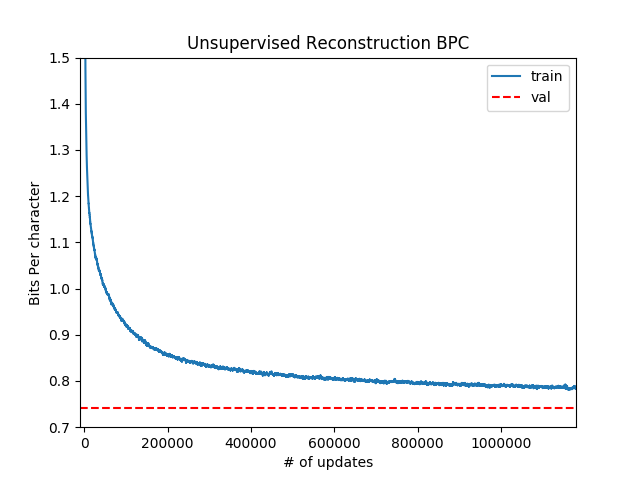

# PyTorch Unsupervised Sentiment Discovery
This codebase is part of our effort to reproduce, analyze, and scale the [Generating Reviews and Discovering Sentiment](https://github.com/openai/generating-reviews-discovering-sentiment) paper from OpenAI.

Early efforts have yielded a training time of 5 days on 8 volta-class gpus down from the training time of 1 month reported in the paper.

A byte-level (char-level) recurrent language model ([multiplicative LSTM](https://arxiv.org/abs/1609.07959)) for unsupervised modeling of large text datasets, such as the [amazon-review dataset](http://jmcauley.ucsd.edu/data/amazon/), is implemented in PyTorch. 

The learned language model can be transferred to other natural language processing (NLP) tasks where it is used to featurize text samples. The featurizations provide a strong initialization point for discriminative language tasks, and allow for competitive task performance given only a few labeled samples. To illustrate this the model is transferred to the [Binary Stanford Sentiment Treebank task](https://nlp.stanford.edu/sentiment/treebank.html).


The model's performance as a whole will increase as it processes more data. However, as is discovered early on in the training process, transferring the model to sentiment classification via Logistic Regression with an L1 penalty leads to the emergence of one neuron (feature) that correlates strongly with sentiment.

This sentiment neuron can be used to accurately and robustly discriminate between postive and negative sentiment given the single feature. A decision boundary of 0 is able to split the distribution of the neuron features into (relatively) distinct positive and negative sentiment clusters. 


Samples from the tails of the feature distribution correlate strongly with positive/negative sentiment.


## ReadMe Contents
 * [Setup](#setup)
   * [Install](#install)
   * [Pretrained Models](#pretrained-models)
   * [Data Downloads](#data-downloads)
 * [Usage](#usage)
   * [Unsupervised Reconstruction](#unsupervised-reconstruction)
     * [Reconstruction Flags](#reconstruction-flags)
   * [Sentiment Transfer](#sentiment-transfer)
     * [Transfer Flags](#transfer-flags)
   * [Transfer To Your Own Data](#transfer-to-your-own-data)
     * [Sentiment Analysis](#sentiment-analysis)
     * [Train a Different Classifier](#train-a-different-classifier)
   * [Heatmap Visualization](#heatmap-visualization)
     * [Visualization Flags](#visualization-flags)
   * [Distributed Usage](#distributed-usage)
 * [SentimentDiscovery Package](#sentimentdiscovery-package)
   * [Modules](#modules)
   * [Flags](#flags)
 * [Analysis](#analysis--)
    * [Why Unsupervised Language Modeling?](./analysis/unsupervised.md)
	   * [Difficulties of Supervised Natural Language](./analysis/unsupervised.md#difficulties-of-supervised-natural-language)
	   * [Data Robustness](./analysis/unsupervised.md#data-robustness)
	   * [Model/Optimization Robustness](./analysis/unsupervised.md#modeloptimization-robustness)
	* [Reproducing Results](./analysis/reproduction.md)
	   * [Training](./analysis/reproduction.md#training)
	      * [Training Setup](./analysis/reproduction.md#training-set-up)
	   * [Transfer](./analysis/reproduction.md#transfer)
	* [Data Parallel Scalability](./analysis/scale.md)
	   * [PyTorch + GIL](./analysis/scale.md#pytorch-gil)
	* [Open Questions](./analysis/questions.md)
 * [Acknowledgement](#acknowledgement)
 * [Thanks](#thanks)

## Setup
### Install
Install the sentiment_discovery package with `pip setup.py install` in order to run the modules/scripts within this repo.

### Python Requirements
At this time we only support python3.
 * numpy
 * pytorch (>= 0.3.0)
 * pandas
 * scikit-learn
 * matplotlib
 * unidecode

### Pretrained models
We've included our own trained mlstm/lstm models as well as OpenAI's mlstm model:
 * [mlstm](https://drive.google.com/file/d/1rcZ42siSqpLlVx2LRR_xjD7uJA8twKEa/view?usp=sharing)[329MB]
 * [lstm](https://drive.google.com/open?id=123fJYmB7F0vfx-oejtA9rgmXk-k34yoH)[264MB]
 * [openai mlstm](https://drive.google.com/open?id=1k96ZwUq8PWoBffz1o-vxHfEVWryCQyHN)[329MB]

### Data Downloads
We've included a link to a preprocessed version of the amazon review dataset. We've also included links to both the full dataset, and a pre-sharded (into train/val/test) version meant for lazy evaluation that we used to generate our results.
 * [full](https://drive.google.com/open?id=1_8dIhs5a53jAkXm3Q7hfMxUdBsUHeg5W)[40GB]
 * [lazy shards](https://drive.google.com/file/d/1ZK2mSBk253SG0oVestvjfp2gnMjIA71Z/view?usp=sharing)[37GB]

## Usage
In addition to providing easily reusable code of the core functionalities of this work in our `sentiment_discovery` package, we also provide scripts to perform the three main high-level functionalities in the paper:
 * unsupervised reconstruction/language modeling of a corpus of text
 * transfer of learned language model to perform sentiment analysis on a specified corpus
 * heatmap visualization of sentiment in a body of text, and conversely generating text according to a fixed sentiment

Script results will be saved/logged to the `<experiment_dir>/<experiment_name>/*` directory hierarchy.

### Unsupervised Reconstruction
Train a recurrent language model (mlstm/lstm) and save it to the `<model_dir>/` directory in the above hierarchy. The metric histories will be available in the appropriate `<history>/` directory in the same hierarchy. In order to apply `weight_norm` only to lstm parameters as specified by the paper we use the `-lstm_only` flag.

```
python text_reconstruction.py -experiment_dir ./experiments -experiment_name mlstm -model_dir model -cuda \
-embed_size 64 -rnn_size 4096 -layers 1 -weight_norm -lstm_only -rnn_type mlstm -dropout 0 -persist_state 1 \
-seq_length 256 -batch_size 32 -lr 0.000125 --optimizer_type=Adam -lr_scheduler LinearLR -epochs 1  \
-train data/amazon/reviews.json -valid data/amazon/reviews.json -test data/amazon/reviews.json \
-data_set_type unsupervised -lazy -text_key sentence 
```

The training process takes in a json list (or csv) file as a dataset where each entry has key (or column) `text_key` containing samples of text to model.

The unsupervised dataset will proportionally take 1002 (1000 train) shards from the training, validation, and test sets.

The dataset entries are [transposed](https://yagr.nvidia.com/ADLR/sentiment-os/blob/master/sentiment_discovery/data_utils/samplers.py#L114) to allow for the concatenation of sequences in order to persist hidden state across a shard in the training process.

Hidden states are reset either at the start of every sequence, every shard, or never based on the value of `persist_state`. See [data flags](#data-flags).

Lastly, We know waiting for more than 1 million updates over 1 epoch for large datasets is a long time. We've set the training script to save the most current model (and data history) every [5000 iterations](https://yagr.nvidia.com/ADLR/sentiment-os/blob/master/text_reconstruction.py#L81), and also included a `-max_iters` flag to end training early.



The resulting loss curve over 1 (x4 because of data parallelism) million iterations should produce a graph similar to this.

**Note:** if it's your first time modeling a particular corpus make sure to turn on the `-preprocess` flag.

#### Reconstruction Flags
For a list of default values for all flags look at `./cfg/configure_text_reconstruction.py`
 * `no_loss` - do not compute or track the loss curve of the model
 * `lr` - Starting learning rate.
 * `lr_scheduler` - one of [ExponentialLR,LinearLR]
 * `lr_factor` - factor by which to decay exponential learning rate
 * `optimizer_type` - Class name of optimizer to use as listed in torch.optim class (ie. SGD, RMSProp, Adam)
 * `clip` - Clip gradients to this maximum value. Default: 1.
 * `epochs` - number of epochs to train for
 * `max_iters` - total number of training iterations to run. Takes presedence over number of epochs
 * `start_epoch` - epoch to start training at (used to resume training for exponential decay scheduler)
 * `start_iter` - what iteration to start training at (used mainly for resuming linear learning rate scheduler)

### Sentiment Transfer
This script parses sample text and binary sentiment labels from csv (or json) data files according to `-text_key`/`label_key`. The text is then featurized and fit to a logistic regression model.

The index of the feature with the largest L1 penalty is then used as the index of the sentiment neuron. The relevant sentiment feature is extracted from the samples' features and then also fit to a logistic regression model to compare performance.

Below is example output for transfering our trained language model to the Binary Stanford Sentiment Treebank task.

```
python3 sentiment_transfer.py -experiment_dir ./experiments -experiment_name mlstm -model_dir model -cuda \
-train binary_sst/train.csv -valid binary_sst/val.csv -test binary_sst/test.csv \
-text_key sentence -label_key label -load_model e0.pt 
```

```
92.11/90.02/91.27 train/val/test accuracy w/ all_neurons
00.12 regularization coef w/ all_neurons
00107 features used w/ all neurons all_neurons
neuron(s) 1285, 1503, 3986, 1228, 2301 are top sentiment neurons
86.36/85.44/86.71 train/val/test accuracy w/ n_neurons
00.50 regularization coef w/ n_neurons
00001 features used w/ all neurons n_neurons
```


These results are saved to `./experiments/mlstm/binary_sst/e0/*`

**Note**: The other neurons are firing, and we can use these neurons in our prediction metrics by setting `-num_neurons` to the desired number of heavily penalized neurons. Even if this option is not enabled the logit visualizations/data are always saved for at least the top 5 neurons.

#### Transfer Flags
For a list of default values for all involved flags look at `./cfg/configure_sentiment_transfer.py`
 * `num_neurons` - number of neurons to consider for sentiment classification
 * `no_test_eval` - do not evaluate the test data for accuracy (useful when your test set has no labels)
 * `write_results` - write results (output probabilities as well as logits of top neurons) of model on test (or train if none is specified) data to specified filepath. (Can only write results to a csv file)

### Transfer to your own data
#### Sentiment Analysis
Analyze sentiment on your own data by using one of the [pretrained models](#pretrained-models) to train on the Stanford Treebank (or other sentiment benchmarks) and evaluating on your own `-test` dataset. 

If you don't have labels for your data set make sure to use the `-no_test_eval` flag. 

#### Train a Different Classifier
If you have your own unique classification dataset complete with training labels, you can also use a pretrained model to extract relevant features for classification. 

Supply your own `-train` (and evaluation) dataset while making sure to specify the right text and label keys.

### HeatMap Visualization
This script takes a piece of text specified by `text` and then visualizes it via a karpathy-style heatmap based on the activations of the specified `neuron`. In order to find the neuron to specify, find the index of the neuron with the largest l1 penalty based on the neuron weight visualizations from the previous section. 

Without loss of generality we're going to go through this section first referring to OpenAI's neuron weights. For this set of weights the sentiment neuron can be found at neuron 2388.


Armed with this information we can use the script to analyze the following exerpt from the beginning of a review about The League of Extraordinary Gentlemen.

```
python3 visualize.py -experiment_dir ./experiments -experiment_name mlstm_paper -model_dir model -cuda \
-text "25 August 2003 League of Extraordinary Gentlemen: Sean Connery is one of the all time greats \
I have been a fan of his since the 1950's." -neuron 2388 -load_model e0.pt 
```


However, not only does this script analyze text, but the user can also specify the begining of a text snippet with `text` and generate additional following text up to a total `seq_length`. Simply set the `-generate` flag.

```
python3 visualize.py -experiment_dir ./experiments -experiment_name mlstm_paper -model_dir model -cuda \
-text "25 August 2003 League of Extraordinary Gentlemen: Sean Connery is" \
-neuron 2388 -load_model e0.pt -generate
```


In addition to generating text, the user can also set the sentiment of the generated text to positive/negative by setting `-overwrite` to +/- 1. Continuing our previous example:


When training a sentiment neuron with this method, sometimes we learn a positive sentiment neuron, and sometimes a negative sentiment neuron. This doesn’t matter, except for when running the visualization. The `negate` flag improves the visualization of negative sentiment models, if you happen to learn one.

```
python3 visualize.py -experiment_dir ./experiments -experiment_name mlstm -model_dir model -cuda \
-text "25 August 2003 League of Extraordinary Gentlemen: Sean Connery is" \
-neuron 1285 -load_model e0.pt -generate -negate -overwrite +/-1
```


The resulting heatmaps are all saved to a png file corresponding of the first 100 characters of (generated or analyzed) text at `<experiment_dir>/<experiment_name>/heatmaps/<heatmap name>`. 

#### Visualization Flags
For a list of default values for all flags look at `./cfg/configure_visualization.py`
 * `text` - whole or initial text for visualization
 * `neuron` - index of sentiment neuron
 * `generate` - generates text following initial text up to a total length of `seq_length`
 * `temperature` - temperature from sampling from language model while generating text
 * `overwrite` - For generated portion of text overwrite the neuron's value while generating
 * `negate` - If `neuron` corresponds to a negative sentiment neuron rather than positive sentiment
 * `layer` - layer of recurrent net to extract neurons from

### Distributed Usage
```
python text_reconstruction.py -experiment_dir ./experiments -experiment_name mlstm -model_dir model -cuda \
-embed_size 64 -rnn_size 4096 -layers 1 -weight_norm -lstm_only -rnn_type mlstm -dropout 0 -persist_state 1 \
-seq_length 256 -batch_size 32 -lr 0.00025 --optimizer_type=Adam -lr_scheduler LinearLR -epochs 1  \
-train data/amazon/reviews.json -valid data/amazon/reviews.json -test data/amazon/reviews.json \
-data_set_type unsupervised -lazy -text_key sentence -num_gpus 2 -distributed
```

In order to utilize Data Parallelism during training time ensure that `-cuda` is in use and that `-num_gpus` >1. As mentioned previously, vanilla DataParallelism produces no speedup for recurrent architectures. In order to circumvent this problem turn on the `-distributed` flag to utilize PyTorch's DistributedDataParallel instead and experience  speedup gains. 

Also make sure to scale the [learning rate](#learning-rate-scaling) as appropriate. Note how we went from `1.25e-4` -> `2.5e-4` learning rates when we doubled the number of gpus.

## SentimentDiscovery Package 
### Modules
 * `sentiment_discovery`
   * `sentiment_discovery.modules`: implementation of multiplicative LSTM, stacked LSTM.
   * `sentiment_discovery.model`: implementation of module for processing text, and model wrapper for running experiments
   * `sentiment_discovery.reparametrization`: implementation of weight reparameterization abstract class, and [weight norm](https://arxiv.org/abs/1602.07868) reparameterization. 
   * `sentiment_discovery.data_utils`: implementations of datasets, data loaders, data samplers, data preprocessing utils.
   * `sentiment_discovery.neuron_transfer`: contains utilities for extracting neurons and featurizing text with the values of a model's neurons.
   * `sentiment_discovery.learning_rates`: contains implementations of learning rate schedules (ie. linear and exponential decay)

### Flags

#### Experiment Flags
 * `experiment_dir` - Root directory for saving results, models, and figures
 * `experiment_name` - Name of experiment used for logging to `<experiment_dir>/<experiment_name>`.

#### Model Flags
 * `should_test` - whether to train or evaluate a model
 * `embed_size` - embedding size for data
 * `rnn_type` - one of <`mlstm`,`lstm`>
 * `rnn_size` - hidden state dimension of rnn
 * `layers` - Number of stacked recurrent layers
 * `dropout` - dropout probability after hidden state (0 = None, 1 = all dropout)
 * `weight_norm` - boolean flag, which, when enabled, will apply weight norm only to the recurrent (m)LSTM parameters
 * `lstm_only` - if `-weight_norm` is applied to the model, apply it to the lstm parmeters only
 * `model_dir` - subdirectory where models are saved in `<experiment_dir>/<experiment_name>`
 * `load_model` - a specific checkpoint file to load from `<experiment_dir>/<experiment_name>/<model_dir>`


#### Data Flags
 * `batch_size` - minibatch size
 * `data_size` - dimension of each data point
 * `seq_length` - length of time sequence for reconstruction/generation (sentiment inference has no maximum sequence length)
 * `data_set_type` - json or csv for sentiment transfer or unsupervised (only json available) for unsupervised reconstruction
 * `persist_state` - degree to which to persist state across samples for unsupervised learnign. 0 = reset state after every sample, 1 = reset state after finishing a shard, -1 = never reset state
 * `transpose` - transpose dataset, given batch size. Is always on for unsupervised learning, (should probably only be used for unsupervised).
 * `no_wrap` - In order to better concatenate strings together for unsupervised learning the batch data sampler does not drop the last batch, it instead "wraps" the dataset around to fill in the last batch of an epoch. On subsequent calls to the batch sampler the data set will have been shifted to account for this "wrapping" and allow for proper hidden state persistence. This is turned on by default in non-unsupervised scripts.
 * `cache` - cache recently used samples, and preemptively cache future data samples. Helps avoid thrashing in large datasets. **Note:** currently buggy and provides no performance benefit

#### Data Processing Flags
 * `lazy` - lazily load dataset (necessary for large datasets such as amazon)
 * `preprocess` - load dataset into memory and preprocess it according to section 4 of the paper. (should only be called once on a dataset)
 * `shuffle` - shuffle unsupervised dataset.
 * `text_key` - column name/dictionary key for extacting text samples from csv/json files.
 * `label_key` - column name/dictionary key for extacting sample labels from csv/json files. 
 * `delim` - column delimiter for csv tokens (eg. ',', '\t', '|')
 * `drop_unlabeled` - drops unlabeled samples from csv/json file 
 * `binarize_sent` - if sentiment labels are not 0 or 1, then binarize them so that the lower half of sentiment ratings get set to 0, and the upper half of the rating scale gets set to 1.

#### Dataset Path Flags
 * `train` - path to training set
 * `split` - float value in [0,1] range. If no validation set is specified then proportionally split training set into `split` and `1-split` training/validation sets
 * `valid` - path to validation set
 * `test` - path to test set

#### Device Flags
 * `cuda` - utilize gpus to process strings. Should be on as cpu is too slow to process this.
 * `num_gpus` - number of gpus available
 * `benchmark` - (sets `torch.backends.cuda.benchmark=True`)

#### System Flags
 * `rank` - distributed process index.
 * `distributed` - train with data parallelism distributed across multiple processes
 * `world_size`- number of distributed processes to run. Do not set. The scripts will automatically set it equal to `num_gpus` (one gpu per process).
 * `verbose` - 2 = enable stdout for all processes (including all the data parallel workers). 1 = enable stdout for master worker. 0 = disable all stdout
 * `seed` - random seed for pytorch random operations
 
## [Analysis](./analysis/)
 * [Why Unsupervised Language Modeling?](./analysis/unsupervised.md)
   * [Difficulties of Supervised Natural Language](./analysis/unsupervised.md#difficulties-of-supervised-natural-language)
   * [Data Robustness](./analysis/unsupervised.md#data-robustness)
   * [Model/Optimization Robustness](./analysis/unsupervised.md#modeloptimization-robustness)
 * [Reproducing Results](./analysis/reproduction.md)
   * [Training](./analysis/reproduction.md#training)
     * [Training Setup](./analysis/reproduction.md#training-set-up)
   * [Transfer](./analysis/reproduction.md#transfer)
 * [Data Parallel Scalability](./analysis/scale.md)
   * [PyTorch + GIL](./analysis/scale.md#pytorch-gil)
 * [Open Questions](./analysis/questions.md)

## Acknowledgement
Thanks to @guillette for providing a lightweight pytorch [port](https://github.com/guillitte/pytorch-sentiment-neuron) of the original weights.

This project uses the [amazon review dataset](http://jmcauley.ucsd.edu/data/amazon/) collected by J. McAuley


## Thanks
Want to help out? Open up an issue with questions/suggestions or pull requests ranging from minor fixes to new functionality.

**May your learning be Deep and Unsupervised.**
