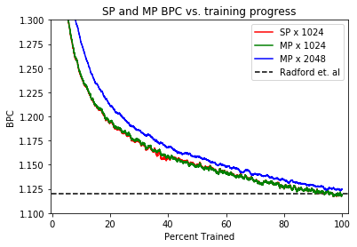

# Reproducing Results
Our reproduction achieved comparable results in both unsupervised reconstruction and sentiment transfer. This is denoted by solid lines for our model and dashed lines for OpenAI's model. We used weights sourced from OpenAI to manually verify performance on our instance of the data.

## Training 
Contrary to results in the OpenAI work the validation reconstruction loss is lower than the training loss. 

We hypothesize that this is due to selecting shards before shuffling the dataset, causing similar samples to end up in the same shard. Even though one shard amounts to `80 million/1002 ~ 80000` reviews, it's still not a representative slice (\< .1%) of the dataset, especially when some categories such as books dominate ~10% of total sample reviews. 

The validation loss could then be low because of one of two (or both) rationales:
 * A non-representative set of data samples that the model excels at. 
 * Similar samples benefit from the hidden state persisted from earlier samples. 

More investigation is required however, to fully interpret this phenomena.

### Training Set Up
It took several cycles of trial and error to come up with a result comparable to the original. Some things were not entirely apparent from the paper, key model details were often hidden in one line, and took several tries to get right. Other minutia were found out independently. We've included what we found to work well.
 * **Model**: 4096-d mLSTM, 64-d embedding, 256-d output. (we also trained a similarly parameterized lstm)
 * **Weight Norm**: applied only to lstm parameters (hidden->hidden/gate weights), not embedding or output. 
 * **Optimizer**: Adam
 * **Learning Rate**: 5e-4 per batch of 128. Linear Learning rate decay to 0 over course of epoch.
 * **Gradient Clipping**: We occassionally ran into problems with destabilizing gradient explosions. Therfore, we clipped our gradients to a maximum of `1.`.
 * **Data set**: Aggressively Deduplicated Amazon Review dataset with 1000/1/1 train/test/validation shards. Each of the three sets are internally shuffled. Samples in a shard are concatenated together so as to persist state across gradient updates.
 * **State Persistence**: The hidden state is persisted across all samples and reset at the start of a shard.
 * **Batch per gpu**: 128 (instead of OpenAI's 32).
 * **Hardware**: 8 volta-class gpus (instead of OpenAI's 4 pascal)
 * **Learning Rate Scaling**: We take queues from recent work in training imagenet at scale and leverage [FAIR's (Goyal et. al 2017)](https://arxiv.org/pdf/1706.02677.pdf) linear scaling rule. To account for our 4x batch size increase and 2x gpu increase we used a learning rate of `5e-4 * 8 -> 4e-3`.
 * **Processing Speed**: With our hardware and batch size we achieved a processing speed (wall-time) of 76k characters/second compared to OpenAI's 12.5k ch/s
 * **Processing Time**: It took approximately 5 days to train on the million samples of the paper and 6.5 days to train on a full epoch of the amazon dataset.

## FP16 Training
Training our models with FP16 arithmetic has proven to be critical for improving turnaround time of our own experiments and the speed of ideation. In addition to the faster arithmetic, with FP16 training we're also able to utilize a 2x larger batch size with no significant computation slowdown. This allows for an additional 2x speedup in training on top of the faster arithmetic.

However, as is often the case with reduced-precision training, training convergence and numeric instability/lack of dynamic range is a concern.

In order to address numeric instability in training we used several techniques that we deemed necessary:
 * **Dynamic loss scaling**: We utilized [dynamic loss scaling's](https://arxiv.org/abs/1710.03740) iterative approach to find a scaling constant for the gradients so that  small gradients do not underflow and important numerical information is not lost during training time.
 * **FP32 Master Params**: We keep a copy of our FP16 parameters in FP32 for accumulating gradient updates. This presents minimal additional compute overhead as elementwise additions are relatively fast in fp32. Furthermore, these FP32 parameters can also be kept on cpu to not consume additional memory.
 * **FP32 Softmax CrossEntropy**: In order to overcome the harsh exponentiation and numerical instability in the softmax operation. We found it necessary to use intermediary FP32 logits when calculating our loss. (The final linear multiplication to get these logits is still done in fp16)
 
We also establish other best practices that did not directly affect our results, but address other possible sources of numeric instability that may arise while training:
 * **FP32 loss reduction**: Any reduction/averaging of more than 65k terms will be met with a dynamic range problem, so we convert any loss scalars to float as a relatively inexpensive safety measure.
 * **FP32 normalization**: Any l2 norm greater than 256 will have a dynamic range problem while computing the norm. As such, we develop a FusedNorm kernel which exponentiates and accumulates values into FP32 before returning the final norm in FP16. This kernel is utilized to perform weight normalization.

Using these techniques we are able to achieve comparable convergence numbers in fp32 and fp16 as shown below.

## Going Bigger with Large Models
We also analyzed the effect of various model sizes on performance.

We utilize FP16's increased speed and reduced memory footprint to train a model with a hidden state size of 8k.

This allows us to further improve on the State of The Art Performance on Amazon Review language modeling and sentiment classification.

 

## Transfer
We chose to reproduce transfer results with the binary Stanford Sentiment Treebank as opposed to the IMDB dataset because of its smaller size, and faster turnaround time for experiments.

Data samples are featurized by running a forward pass of the model over the data and extracting the cell (not hidden) state from the last token. 

These features are used for training a logistic regression model (via sklearn/PyTorch) against the samples' associated labels. We use classification performance on a hold out validation set to select an L1 regularization hyperparameter. 

The feature with the largest L1 penalty is then treated as a "sentiment neuron" to classify the samples and analyze difference in performance.

**It should be noted that the our model learns negatively correlated sentiment feature**

------

[<- Why Unsupervised Language Modeling?](./unsupervised.md) | [Data Parallel Scalability ->](./scale.md)