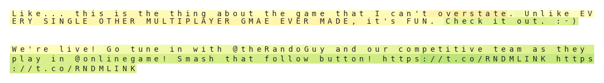

# Why Unsupervised Language Modeling?
## Difficulties of Supervised Natural Language
The success of Deep Learning is not enjoyed to the same extent in the domain of Natural Language Processing (NLP), as in other domains such as Computer Vision and Speech. This is in part due to difficulties in collecting and modeling language data.

For example, creating supervised datasets for vision tasks can be as straightforward as capturing image or video data with a personal device, and tasking a labeler to perform a task in basic classification, bounding boxes, segmentation mask etc.

This is in contrast with gathering and labeling data for language tasks. For starters, the media of data gathering is wildly different. Visual data is captured through the lens of a camera, a perfect device, while language data must first originate as an idea in a person's mind, and be transcribed in imperfect form by them putting pen to paper, before ever being collected by one of many custom web scrapers. 

Assuming that a relatively clean dataset can be aggregated, labeling has its own unique set of problems. Some tasks have an easily agreed-upon label, some require labelers to converse normally with chatbots, but some can require a high degree of reading comprehension and language understanding. Consider the slightly tangential task of predicting author emotion/mood as opposed to sentiment. This is a straightforward task with a correct answer that has appeared on many a student's standardized tests; however, reading comprehension questions are difficult, and has subsequently been missed by a proportional number of students.

This in turn has limited supervised language to tasks with easily interpreted, collected, and agreed upon labels such as neural machine translation, dictionary definition, tree parsing, and sentiment analysis to name a few.

Transfering an unsupervised model to the domain of sentiment analysis is attractive from a research standpoint as it both:
 * has a relatively large corpus of research, datasets, and benchmarks to measure performance
 * is a simple discriminitive classification task that easily benefits from robust featurizations of text (provided by an unsupervised language model)

Overall, language is hard and communicating with it effectively on a daily basis can elude even the best of us. Communicating language information to AI via labels is even more difficult. Given this bottleneck we see robust unsupervised learning regimes for natural language as an attractive research avenue in order to mitigate tasks' dependences on large, labeled, datasets.  

## Data Robustness 
Utilization of byte-level recurrent models allows for learning directly on the binary values of the text (since one character is one byte/8 bits). This is advantageous for data collection and processing as it allows us to work with a wide range of text samples, such as these, without any tokenization and little data cleaning:
 

 
No feature engineering has to be done at the data processing level to determine how to handle:
 * **Capitalization**: We don't have to create distinct tokenizations between capitalized/uncaptilized words. 
 * **Misspelling**: It's robust to misspelings like GAME -> GMAE without having to clean it or making a unique token.
 * **Unknown entities**: Most importantly, perhaps, it's able to process unknown entities such as twitter handles, hashtags, links, and emojis. 
   * It doesn't get confused by the bad grammar, captilization or spacing associated with handles & hashtags. 
   * It can handle the random strings of uncleaned links. 
   * It doesn't necesarily focus on the entities, rather it focuses on the prepositions around entities that it knows corresponds to certain sentiments. 
   * For frequent entities that tie with sentiment like emojis/ascii art, it is however able to learn the positive or negative sentiment associated with them.

## Model/Optimization Robustness
Accurately labeling and training on supervised language datasets is difficult. As the quality of labelers goes up, the volume of labels shrinks and vice-versa. 

Fitting to small, well-labeled datasets can produce competitive results given domain expertise and intelligent feature engineering; however, more often than not over-parameterized neural networks will pick up on specific niche patterns, miss the bigger picture, and overfit. 

Large noisy datasets have plenty of data, and with good labeling practice, law of large numbers will be in your favor and you'll get a sensible distribution of labels for a particular data point. However, extra walltime will be spent training on and sifting through these data points in order to reach a particular performance threshold. This is further aggravated by known problems in training recurrent models. Specifically,
 * Recurrent models are sequential in nature, not ammenable to parallelization, and take a long time to process forward and backward propagation.
 * Because of gradient vanishing, training models on long sequences takes additional time. 
   * Important gradients at the begining of a long sequence might not be effectively learned without more iterations.
 * The recurrent weight space is difficult to optimize and often filled with saddle points.

Pretraining models with unsupervised learning is effective in both these scenarios:
 * Instead of training classficiation models End2End and backpropagating through time, only the output/classification layers have to be trained, greatly reducing training time on a target dataset.
   * Training the recurrent portion of the network will take a fixed time with each training iteration, since the unsupervised dataset is processed in fixed length sequences.
 * In the event that the target transfer task has a highly correlated single feature, only a single decision boundary (for linear models) can be formed for this feature. This single feature and boundary can help avoid overfitting to complex patterns that appear in small labeled sets of data. Furthermore, the approximate value of this decision boundary can be teased apart with relatively few samples (if there are n values then a decision boundary can be found in O(logn) time with binary search).

-----

[Reproducing Results ->](./reproduction.md) 